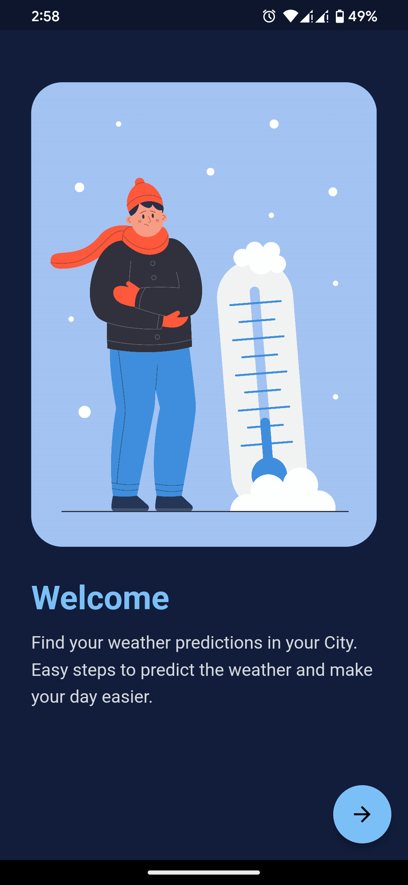
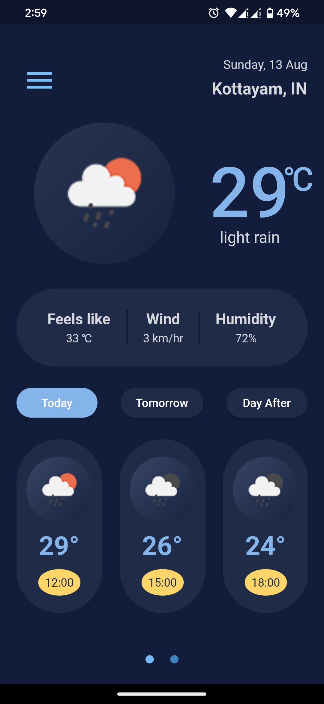
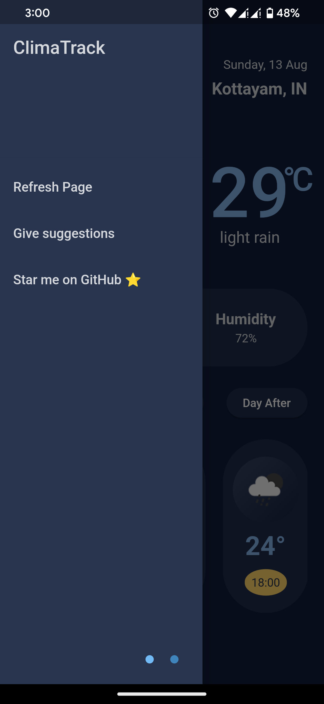

# ClimaTrack

ClimaTrack is a Flutter App to view the present climate and forecasts next two day's climate for the given location.

[](https://flutter.dev/)

### Don't forget to ⭐ the repo


[Download the App]('https://github.com/nikhilputhumana/ClimaTrack/releases/download/1.0.0/app-arm64-v8a-release.apk')

## Features

The app shows the following details of each location:
* Temperature
* Humidity
* Wind speed
* Description of current weather
* Temperature actually felt

The app also forecasts the weather for next 2 days for different time zones.

## Screenshots
  
 

## Dependencies Used
The following dependencies were used in this project:

* free_place_search
* geocoding
* geolocator
* http
* shared_preferences
* intl
* url_launcher

## Building from Source

1. If you don't have Flutter SDK installed, please visit official [Flutter](https://flutter.dev/) site.
2. Fetch latest source code from master branch.

```
git clone https://github.com/nikhilputhumana/ClimaTrack.git
```

3. Run the app with Android Studio or VS Code. Or the command line:

```
flutter pub get
flutter run
```

## Contributing

[Pull requests](https://github.com/nikhilputhumana/ClimaTrack/compare) are welcome. For major changes, please open an issue first
to discuss what you would like to change.

## License

[MIT](https://choosealicense.com/licenses/mit/)